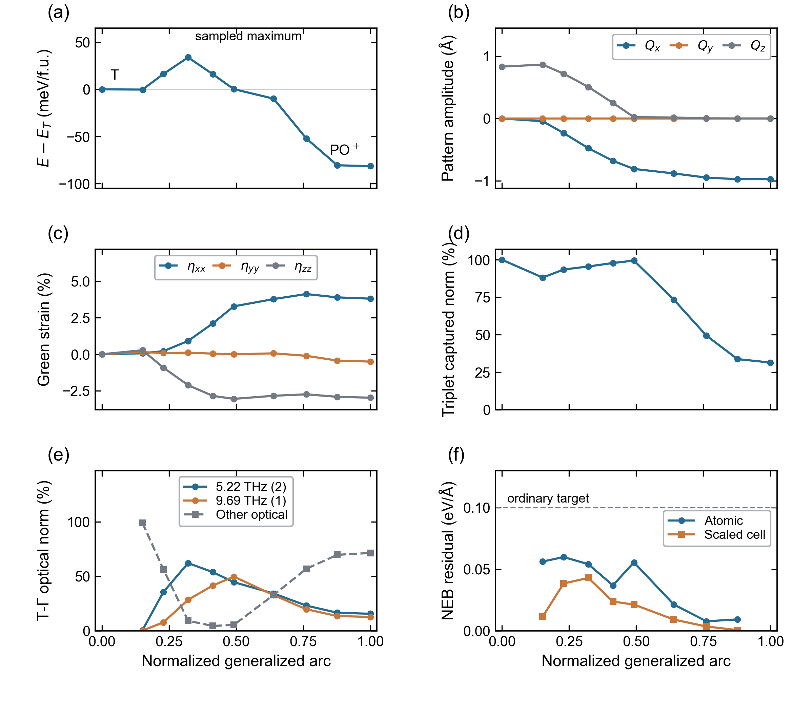

# Competing switching and phase-escape channels in hafnia: a mode-strain pathway analysis

Working manuscript, 2026-10-09. This is a connected main-text draft, not a
submission-ready article. The numerical Results below use explicitly dated
pilot observations. Matched-boundary G2 results, local conditional branches
and independent material predictions are still missing. An abstract and a
conclusion asserting those unmeasured results are deliberately withheld.
The [methods working record](METHODS_DRAFT.md),
[dated pilot record](PILOT_RESULTS_2026-10-08.md) and
[prospective protocol](../../docs/HFO2_PREDICTION_PROTOCOL_V2_2026-10-09.md)
remain the detailed sources; this draft does not replace their provenance.

## 1. Introduction

A polar crystal must do more than possess a metastable energy minimum to be
usefully switchable. A structural route to the opposite polarization can
compete with routes that leave the polar phase altogether. Lowering a
polarization-reversal barrier is therefore not, by itself, evidence that the
polar phase becomes more resistant to structural escape. Hafnia provides a
particularly useful setting for separating these questions because several
polar and nonpolar structures can be connected through coupled atomic
distortions and lattice deformation. Our question is whether a common
mechanical intervention can facilitate homogeneous switching without
facilitating the easiest examined route out of the polar well.

The connection between mechanical constraints and hafnia pathways is already
well established. Liu and Hanrahan studied orientation, epitaxial strain and
variable-cell transformation barriers, while Delodovici, Barone and Picozzi
identified coupled lattice distortions and their strain response.
([Liu and Hanrahan, 2019](https://doi.org/10.1103/PhysRevMaterials.3.054404);
[Delodovici et al., 2021](https://doi.org/10.1103/PhysRevMaterials.5.064405))
Behara and Van der Ven connected strain coordinates, structural variants and
switching pathways, including a change of intermediate when the entire
orthorhombic cell is fixed. Lattice-mode analysis by Qi, Singh and Rabe
further demonstrates that reversing polarization does not uniquely specify
the accompanying nonpolar distortions or the switching route.
([Behara and Van der Ven, 2022](https://doi.org/10.1103/PhysRevMaterials.6.054403);
[Qi et al., 2025](https://doi.org/10.1103/PhysRevB.111.134106))
Neither mode enumeration nor a strain-induced pathway change is consequently
a new result to be established by repeating these calculations.
Constrained-mode landscapes have also predicted switching mechanisms that
were subsequently checked by NEB; independent DFT validation alone is not
our novelty criterion.
([Zhou et al., 2022](https://doi.org/10.1126/sciadv.add5953))

The interpretation of a reduced landscape also depends on its reference and
mechanical boundary. Qi and Rabe organize competing structures using unstable
bands of a Cmma reference, providing a strong alternative to a selected
tetragonal-mode representation.
([Qi and Rabe, 2025](https://doi.org/10.1103/9759-kp38))
More recently, phonon-pair condensation has been used to explain low-energy
domain-wall motifs in hafnia. That interface mechanism cannot be equated
with a homogeneous transformation barrier.
([Lee et al., 2026](https://doi.org/10.1103/63lf-k7zs))
Fan, Zhu and Liu show that Pbcn energetics depend on the functional and
boundary, including strain-dependent switching under a fully prescribed
PO-referenced lattice. The present partially clamped T-referenced ensemble
is different; matching its electronic settings does not erase that distinction.
([Fan et al., 2025](https://doi.org/10.1038/s41524-025-01647-w))

We therefore formulate a narrower test than discovery of a new coupled mode
or a low-energy intermediate. First, we compare switching and phase escape
from the same polar initial state, separating absolute barriers from their
difference. Second, we ask whether measured mode-strain responses and
explicit transverse-stability checks can predict their changes at an
unseen mechanical condition. The proposed reduction is tested against
strong fixed-reference, endpoint-response and direct barrier-interpolation
controls. Its success requires a resolved advantage in independent material
predictions; visual compactness of a mode plot is not sufficient.

## 2. Theory and computational approach

### 2.1. Joint pathways and a common energy reference

Ordinary NEB relaxes the physical force perpendicular to the path while
springs control image spacing. Atomic-cell extensions incorporate lattice
degrees of freedom with an explicit relative metric.
([Sheppard et al., 2012](https://doi.org/10.1063/1.3684549);
[Qian et al., 2013](https://doi.org/10.1016/j.cpc.2013.04.004))
VARNEB applies these established path ideas through energy, force and stress
results obtained via ASE-compatible calculators. The backend, optimizer and
mechanical active space are independent choices. Ordered atoms, reference
cells and continuous periodic lifts are preserved during optimization and
analysis; an image-wise remapping is not a physical pathway improvement.

For candidate channel $\alpha$ at condition $c$, define its bottleneck barrier
from the same initial well $I$ as

$$
B_\alpha(c)=E^\dagger_\alpha(c)-E_I(c).
$$

Here a stationary bottleneck and a discrete sampled maximum are distinguished;
the latter is denoted by a hat in the pilot interpretation. With a common $I$,
the initial-well energy cancels from $B_\alpha-B_\beta$. A change in relative
channel selectivity thus cannot be explained by shifting that common well
alone. In the declared candidate set, we use

$$
B_s=\min_{\alpha\in\mathcal S}B_\alpha,\qquad
B_d=\min_{\alpha\in\mathcal D}B_\alpha,\qquad S=B_d-B_s.
$$

An increased $S$ is relative selectivity, not improved absolute resistance to
escape. The stronger prospective test requires a resolved reduction of $B_s$
and a lower uncertainty bound on $\Delta B_d$ no smaller than zero. An unresolved
decay response is inconclusive, not evidence of noninferiority. This primary
allowable-loss margin is fixed before boundary-response labels. Both T and M escape candidates
are retained. These are candidate-set statements, not an exhaustive network
or a calculation of device lifetime. At finite prescribed pressure the
objective would be $E+PV$; all hafnia results here instead use $P=0$ and $E$.

### 2.2. Mechanical ensembles and branch-aware reduction

All images and endpoints of one path share the same permitted cell space.
The planned epitaxial experiment fixes two T-referenced in-plane vectors
and releases the third vector, including its two tilt components. Atomic
and cell variables are relaxed in that same space. A clamped reaction stress
is not an open-coordinate convergence failure. Zero applied stress and
zero nominal substrate strain are distinct ensembles, and are not adjacent
points of a single strain derivative.

A retained coordinate $q$ can specify one mode or a declared combination of
modes. A frozen slice keeps the remaining coordinates $r$ fixed. A conditional
surface instead follows a particular local minimum in the permitted r
space at each $q$; the lower envelope over branches is a third object.
With $q$ and $r$ measured from the same expansion centre and stable $H_{rr}$, local
quadratic release gives

$$
r^*(q)=-H_{rr}^{-1}(g_r+H_{rq}q),\qquad
K_{\mathrm{eff}}=H_{qq}-H_{qr}H_{rr}^{-1}H_{rq}.
$$

The offset from a nonzero $g_r$ is retained. The Schur complement is standard
mathematics, not a new theorem. An unresolved or unstable eliminated block
invalidates this release; a physical unstable direction cannot be removed
by a pseudoinverse. Unmeasured directions remain fixed, not implicitly stable.
At a smooth constrained stationary branch, the corresponding barrier strain
derivative is the difference of bottleneck and initial-state work derivatives,
evaluated with their actual cell Jacobians and volumes. An ordinary NEB
sampled peak alone does not justify that stationary-branch formula.

### 2.3. Fixed material contract and prospective comparisons

The production model is periodic Hf4O8, twelve atoms and four formula units,
with zero external pressure and field. Calculations use ABACUS/PBE, the
original Hf/O pseudopotentials, full 10-au DZP orbitals generated at 100 Ry,
ecutwfc=100 Ry and the original Gamma-centred 2x2x2 mesh. INPUT, KPT,
pseudopotentials and orbital bytes are bound to each observation by hashes.
No electronic setting is retuned between channels or mechanical conditions.
Ordinary NEB uses 0.10 eV/Angstrom, without climbing images; cached fixed
endpoints are not recalculated at every iteration. The repaired T-PO band
has ten total images, while new channel bands have nine total, seven moving.
A residual pass does not supply a barrier error or a saddle certificate.

The subsequent fixed-plane comparison uses strain 0 and +1%, with +0.5%
reserved as an unseen in-range condition. Predictions and their visible
inputs are frozen before complete held-out path labels are inspected.
Controls include direct barrier interpolation, two endpoint-response nulls,
strong T/Cmma references and restricted versus released reductions.
Unavailable predictions and unstable branches are reported as abstentions.
Actual SCF calls and allocation core-hours, including preparation, define
cost; faster optimization to a different mechanism is not same-path
acceleration. The [detailed methods](METHODS_DRAFT.md) retain unit, gauge,
stability, selection and uncertainty definitions.

## 3. Present results: audited pilot evidence

### 3.1. The formation band and the shared polar starting well

The repaired T-PO band passes the ordinary residual criterion with
0.0598816 eV/Angstrom. Its ten frozen images reproduce complete same-contract
energies, forces and stresses; its endpoints are unchanged. The discrete
T-to-PO maximum is 33.889 meV/f.u. Reversing the thermodynamic view, without
reoptimizing or remapping the band, gives 115.210 meV/f.u. for PO-to-T.
Their difference equals the endpoint energy change, -81.321 meV/f.u.
This is the first residual-passed candidate edge, not a sampling-resolved
absolute activation barrier or a full-variable TS.
([Numerical source](../../benchmarks/hfo2_channels/20261008/converged_gap/README.md))

Figure 1. Audited discrete energy, geometric pattern amplitudes, Green strain,
reference-subspace weights and ordinary residuals along T-to-PO. Connections
join samples, not an independently validated smooth MEP. Reference phonons
are not local bottleneck eigenvectors or mode energy contributions; fixed
endpoints have no NEB residual. Complete captions, CSV and reproduction
instructions are in the [figure bundle](figures/hfo2_T_PO_ordinary_20261008/README.md).

All four candidate observations share the ordered PO+ energy
-9783.249675811956 eV/cell. The following table uses the complete frozen
morning frames, not later rounded values from the live optimization logs:

| Candidate from PO+ | Source job/step | Residual | Maximum | Pass |
|---|---|---:|---:|---|
| PO-to-T, reverse view | 28300425/6 | 0.059882 | 115.210 | Yes |
| PO-to-M | 28298794/39 | 0.097904 | 71.582 | Yes |
| T-pattern-preserving flip | 28319570/48 | 0.204909 | 39.069 | No |
| T-pattern-reversing flip | 28319571/12 | 0.455054 | 397.429 | No |

Table 1. Provisional observations, not a converged ranking. Snapshot steps
and times differ, two switching sources remain unconverged, and numerical/sampling
barrier bounds have not been measured. Residuals are in eV/Angstrom and
sampled maxima in meV/f.u.; maxima include the endpoints and use four formula
units per cell. The two flip labels denote registered geometric
operations, not certified distinct MEPs or assignments to published irreps.
The [morning 37-record audit](../../benchmarks/hfo2_channels/20261008/morning_update_20261009_0850/README.md)
includes cached endpoints and reused records, not 37 new or independent SCFs.

PO-to-M terminated normally at the unchanged force threshold. Its ordered
M endpoint is P2_1/c at all three declared symmetry tolerances. The sampled
forward/reverse maxima are 71.582/142.967 meV/f.u., with reaction energy
-71.385 meV/f.u.; their difference follows from the common endpoint energies.
The sampled peak at image 3 still has a nonzero physical tangential
generalized force, -0.383495 eV/Angstrom. Thus this second ordinary-converged
edge does not establish a stationary bottleneck or its sampling error.

### 3.2. Nonpolar snapshots do not uniquely identify a switching mechanism

The earlier preserving snapshot at step 14 had a Pbcn central sampled
maximum across the declared 0.001/0.01/0.05 Angstrom symmetry tolerances.
The complete step-48 profile has instead split into two sampled local peaks,
images 3 and 5, at 39.069477 and 39.069483 meV/f.u. Both are Pca2_1 at those
tolerances. The central image remains Pbcn but is lower, 17.440944 meV/f.u.,
with a scaled-cell residual of 0.204909 eV/Angstrom. It is neither the current
highest image nor a certified stable intermediate. A phase label or an
earlier central peak cannot therefore fix the eventual bottleneck location.

The reversing centre is Pbca at the same tolerances despite essentially zero
amplitude in the selected rotated-T pattern triplet. Vanishing coordinates
in a truncated representation do not identify a cubic structure. Its group
label in this twelve-atom cell also does not identify a twenty-four-atom
literature variant or a domain-wall motif. The PO-to-M peak retains its
P1/P2_1 tolerance dependence rather than being standardized to a preferred
label.

Figure 2. Earlier dated common-initial-state observations: steps 6/20/14/10,
not the later morning frames in Table 1. Discrete energies, residuals,
registered shuffle and strain are retained without substituting newer
values into this historical figure. The high reversing profile lies outside
the explicitly disclosed low-energy panel(a) range; all original values
remain in its CSV. No final energetic hierarchy follows from this figure.
The [figure contract](figures/hfo2_G1_provisional_20261009/README.md) retains
phase checks, original lifts and complete provenance.

These are mechanism candidates for further relaxation, not discoveries of
Pbcn-mediated switching or of an antipolar wall. A group symbol at one
uniform snapshot does not map it onto the motif, boundary or energy of a
published interface. Fixed and released lattice results must also remain
separate rather than being pooled under a common phase label.

The preserving band's dominant residual changes from cell rows at step 14
to atoms at steps 25/27, then back to cell rows at step 48. Its decreasing
sampled maximum and rebound of the global force norm are compatible with
a changing coupled configuration, not proof of a persistent single-block
cause or of a particular optimizer's benefit. The two switching candidates
must still be relaxed before this evolving profile supports a channel
ranking or fixes the locations used for local mode-strain analysis.

### 3.3. Reference choice changes the apparent compactness of the path

In the unweighted parent-scaffold chart, the three geometric T patterns
capture 95.54% of the formation band's squared displacement at its sampled
maximum, but only 31.43% at PO. Local compactness does not establish a
global few-mode plane. Complete T-Gamma subspaces are evaluated separately
in their mass metric; their displacement weights are not energy fractions.

The stronger published Cmma reference is registered without using modal
coverage to choose its frame. Four tied registrations are retained. In the
common T-origin mass metric, its four-direction span captures 27.18-27.19%
at the formation maximum and 52.24% at PO, versus 89.69% and 30.42% for
the three T patterns. The different reference and metric explain why those
fractions must not be mixed with the preceding scaffold values. The lower
or higher coverage of one chosen span is not a test of a nonlinear fixed-parent
model. Published LDA directions are used as geometric candidates, not as
our PBE Hessian or energy model.
([Registration and scalar evidence](../../benchmarks/hfo2_channels/20261008/cmma_path_mapping/README.md))

### 3.4. A measured mixed response exposes a conditional-model limitation

Eight existing same-centre probes at a nonstationary historical image supply
a restricted atomic-strain quadratic block. Releasing only its measured
atomic direction softens the retained strain curvature by 12.36%/12.43%
at the two amplitudes. Four previously seen longer-axis checks give a
maximum energy residual of 0.04169 meV/cell; this is retrospective consistency,
not an independent barrier forecast or a total uncertainty estimate.

The predicted atomic offset, 0.02165 Angstrom, places the specified release
line outside the probe convex hull. The mixed response is measured, but a
conditional DFT branch is unvalidated. No stationary T Hessian is spliced
into this different centre, and stability of unmeasured directions is not
assumed. This failed coverage test identifies what the local model cannot
yet predict, rather than being concealed by a smooth contour.
([Same-centre data and limits](../../benchmarks/hfo2_channels/20261008/restricted_quadratic/README.md))

## 4. Discussion and remaining material tests

The present data establish that a compact local projection, an apparently
nonpolar midpoint and an ordinary residual pass answer different questions.
None alone determines the competition between homogeneous switching and
phase escape. The core proposed result remains the channel-selective
response to one matched mechanical intervention, not a phase-label survey.

The next Results section must contain the registered fixed-plane responses
of absolute switching and escape barriers, endpoint energies and branch
identities. A favorable selectivity change without preserved escape resistance
will be reported as the weaker outcome. If an endpoint disappears under
that boundary, it will not be forced into a nominal two-well band. Independent
predictions must subsequently outperform the declared strong controls at
measured resolution; interpolation or a fixed-parent model may perform equally
well. New directions added after reading labels are revised training, not
successful original forecasts. These tests are still incomplete.

All present conclusions concern periodic small-cell, zero-field, zero-temperature
energy pathways under the named electronic contract. They do not establish
domain-wall nucleation, switching rates, retention times, finite-temperature
free energies or functional-independent critical strains. The preceding pilot
observations support the finite investigation, but are not sufficient for
the intended JCTC methodology claim.

## Appendix A. Reproducibility and editorial completion checks

The archived cases provide frozen numeric observations, input/log/geometry
checksums, continuous ordered lifts, analysis commands and figure CSVs.
Raw production logs remain read-only on HF. Earlier incomplete snapshots
remain dated evidence rather than being overwritten by final values.
No external paper figure or unpublished author dataset is copied into this draft.

Before a submission-ready abstract or conclusion is written, this manuscript
requires: completed candidate paths and error/phase audits; matched G2 material
responses; same-boundary conditional-branch and transverse-stability evidence;
prospectively frozen predictions with strong-control comparison and actual
cost accounting; final numeric captions and an openly reproducible release
of the results permitted for redistribution. These are requirements, not
claims that those outcomes have been achieved. Details belong in main-text
appendices rather than a separate supplementary manuscript, as requested.
