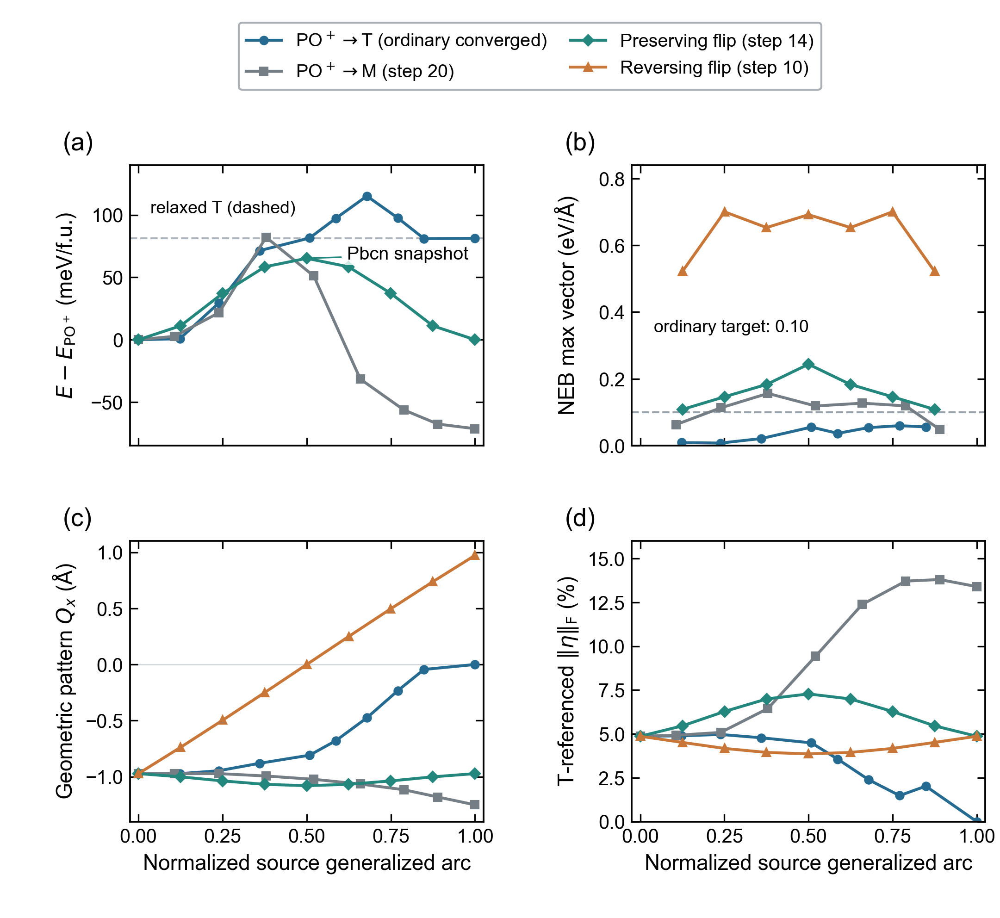

# Provisional common-PO mechanism figure, 9 October2026



**Figure | Same-initial-state energies, residuals and geometric mechanisms.**
(a) Three discrete low-energy profiles relative to common PO+ at zero pressure
and field; the dashed line is the actual relaxed T energy. The fourth,
reversing-flip snapshot has a410.744 meV/f.u. sampled maximum and is retained
in full in `source_data.csv` and the linked data table, not squeezed into
the panel's low-energy range. (b) Ordinary NEB maximum vectors per moving
image for all four candidates; fixed endpoints have no NEB force. The target
remains0.10 eV/Angstrom. (c) Geometric rotated-T-pattern Qx, the registered
preserving/reversing shuffle coordinate, not polarization or mode energy.
(d) Frobenius norm of the Green strain relative to the original ordered T
cell, multiplied by100; it is not stress or elastic energy. Each trace uses
its source's normalized joint arc, with original atom lifts and forces.

Only PO→T passes the ordinary residual threshold. Other lines are differently
timed complete snapshots, not final MEPs. The Pbcn annotation denotes a
tolerance-checked **sampled maximum**, not a relaxed intermediate or certified
transition state. Discrete connections contain no fitted/interpolated samples.
One deterministic snapshot per candidate supplies no statistical replicates
or measured numerical-uncertainty bars. This is a working-draft evidence figure,
not a completed JCTC claim.

## Reproduce and verify

Inputs, raw audit, snapshot steps and interpretation are in the
[E025 data bundle](../../../../benchmarks/hfo2_channels/20261008/network_update_20261009/README.md).
Plotting first replays every physical and source field of
`material_observations_v3.json`; stale energy, force, phase or source hash
fails before drawing. Cache-dependent symmetry deprecation counts and actual
package versions are retained on both sides as runtime metadata, not used
as a scientific descriptor or a reason to weaken physical checks.

```powershell
python -m scripts.plot_hfo2_network_update --specification benchmarks/hfo2_channels/20261008/network_update_20261009/network_specification.json --material-report benchmarks/hfo2_channels/20261008/network_update_20261009/material_observations_v3.json --output E:/TEMP/hfo2-G1-replay-new
```

Choose a new output directory. Editable-text SVG and vector PDF,300dpi PNG,
600dpi LZW TIFF and37-row CSV are provided. The183x168mm2x2 grid follows the
user's normal-weight13pt(a–d),11pt axes/10pt ticks, top/right spines and ticks,
aligned panels without titles and boxed semi-transparent white shared legend
outside the curves. `qa.json` records generated layout and artifact hashes;
`visual_review.json` records the subsequent actual PNG inspection separately.
